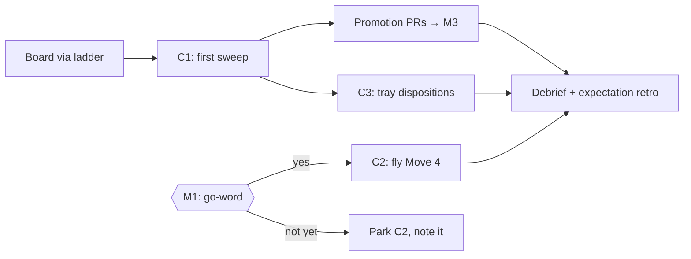

# Handoff — Weekend Closeout → Next Session (2026-07-19/20)

> Everything from the weekend is terminal or queued; nothing lives in anyone's
> head. The maintainer's tray is two words and a glance (Move 4 go-word ·
> Actions tab · sweep promotions). The crew's queue, in priority order: run
> the FIRST distillation sweep over seven durable seeds, fly Move 4 on the
> go-word (plan already validated in draft PR #106), disposition the code
> tray, and consider a gauntlet ninth step. Board via the ladder
> (`klappy://canon/bootstrap/otto-boarding-pass`, now kernel-threaded); the
> lane rules are served corpus law (`klappy://ars/policy/dispatch-flight-rules`).
> All receipts below. Estimated maintainer attention to clear his entire
> tray: ~3 minutes.

## Summary — Board, Sweep, Wait for Three Words, Fly

The weekend closed the night charter (13+ merges, 3 repos), shipped the
runtime lane end-to-end (Move 3, #100 injector proven live), rebuilt corpus
serving twice under maintainer rulings (self-serve → content-addressed,
zero staleness), threaded the trust-kernel through every bootstrap surface,
ratified the meta-expectation machinery (conventions v0.8.0), and published
a gauntlet-run public essay. What remains splits cleanly: three
maintainer-only calls, and crew work that starts with the feeding loop's
first-ever sweep. This handoff is the boarding cargo: state, queue, owners,
estimates, and the meta-expectations the new session flies under.

---

## 1. First five minutes (boarding script)

1. `oddkit_time` (pass a reference; never infer the calendar).
2. The ladder: project instructions are Rung 0 (kernel-threaded, freshly
   re-pasted by the maintainer) → fetch the operating contract + card.
3. `board_brief` + this handoff. The seven seeds and the debrief live
   durably in `klappy/outcomes-driven-development` (see §4) — outputs files
   from prior sessions do NOT survive; the repo does.
4. Repo state (verify, don't trust): ARS main `ec674a0` (content-addressed
   corpus live) · klappy.dev main `6a52134` (essay + voice pass) · ODD main
   `be3c9e9`+ (seeds anchored to the trust-kernel).

## 2. The maintainer's tray (total ≈ 3 minutes of attention)

| # | Item | The ask | Cost |
|---|------|---------|------|
| M1 | **Move 4 go-word** — draft PR #106 (ARS), HOLD banner | Three words: **"lane-only, confirmed, go"** (or amend scope) | ~1 min |
| M2 | **Actions tab** — is CI executing? Seat tokens cannot hold `actions:read` | One glance; enable if empty | ~30 sec |
| M3 | **Sweep promotions** — arrive only AFTER crew runs C1 below | Merge what deserves canon; ignore the rest | later, batched |

## 3. The crew queue (priority order)

| # | Work | Charter/spec | Est. | Gate |
|---|------|--------------|------|------|
| C1 | **First distillation sweep** — the loop's inaugural run over the 7 seeds in §4; draft canon PRs via the Promotion Pipeline; promotions land in M3 | Feeding-loop PRD (ODD, merged `46b2e9b`, rulings encoded) | 1 flight, 30–50 turns | none — GO at boarding |
| C2 | **Move 4 execution** — four layers, one commit each, suite-green per layer; L3 is the risk layer (shared helpers must survive) | Plan in draft PR #106 (validated); PRD ars-simplification-v1 §Move 4 | 1 build flight + G5 per plan | **M1 word** |
| C3 | **Code tray dispositions** — #80 ready-not-draft (needs spec or maintainer call), #79/#83/#91 spec-less → his board; write the one-line disposition per PR | Night-charter triage table | 20 min seat work | none |
| C4 | **Gauntlet ninth step?** — two post-publication catches (author-identity prominence; dual-context vocabulary) suggest a "voice & attribution" check; propose, don't self-canonize | The two amendments: klappy.dev PRs #303, #304 | 1 candidate draft | sweep (C1) |
| C5 | Cache freshness note — corpus `latest` pointer + per-request sha check landed; confirm live behavior post-deploy once, record `corpusSource()` sample | PRD corpus-self-serve v1.1 §DoD | 5 min | deploy cycle |

## 4. The seven durable seeds (C1's input — all in ODD `candidates/`)

1. `2026-07-18` **policies-vs-requirements** (ratified, Jesse)
2. `2026-07-18` **rebuild-vs-modify tipping point** (ratified)
3. `2026-07-19` **learning-to-learn meta-skill** (kernel-derived)
4. `2026-07-19` **expectation retrospectives** + v0 rubric (kernel-derived; parent-principle §)
5. debrief line: **a cache is a lie in wait** (anti-cache-lying applied; corpus incident)
6. debrief line: **search canon before designing** (the constraint existed since Feb)
7. debrief line: **dual-context vocabulary** (cockpit words stay in the cockpit)

Lines 5–7 plus the retro misses (well-validated / communication / bounded)
live in the committed debrief: `odd/debriefs/2026-07-19-weekend-closeout.md`.

## 5. Lane law (fetch, don't recall — one-line map)

`klappy://ars/policy/dispatch-flight-rules` (corpus-served): repo-param
dispatch, no secrets in briefs, no api.github.com in containers,
`pull/N/head` for PR branches, own-commits scope judgment, 25–30 validator
turns, verdict-first <900 chars, R2 result recovery, 409 = ls-remote first.
Grants standing: **G5** (validation-as-approval; exclusions are the
maintainer's line) · **C1** (full-job-scope mints; expiry is rotation).

## 6. META-EXPECTATIONS for the next session (per conventions v0.8.0)

- **Feel:** calm and boring — the plumbing is fixed; casualties should be
  rare and instructive, not thematic.
- **Success:** C1 sweep flown and promotions teed within one sitting; M-tray
  cleared inside its 3-minute budget; every landing G5'd.
- **Failure looks like:** re-learning anything in §5; asking the maintainer
  a question canon answers; outputs-only artifacts (durability = repo).
- **Finish:** when C1 lands and C2 is either flown (word given) or cleanly
  parked (word absent) — then debrief with the rubric, even on success.

*Filed by the closing seat, sess_29f844a6, 2026-07-20 ~03:45Z. The record
remembers so nobody has to.*
